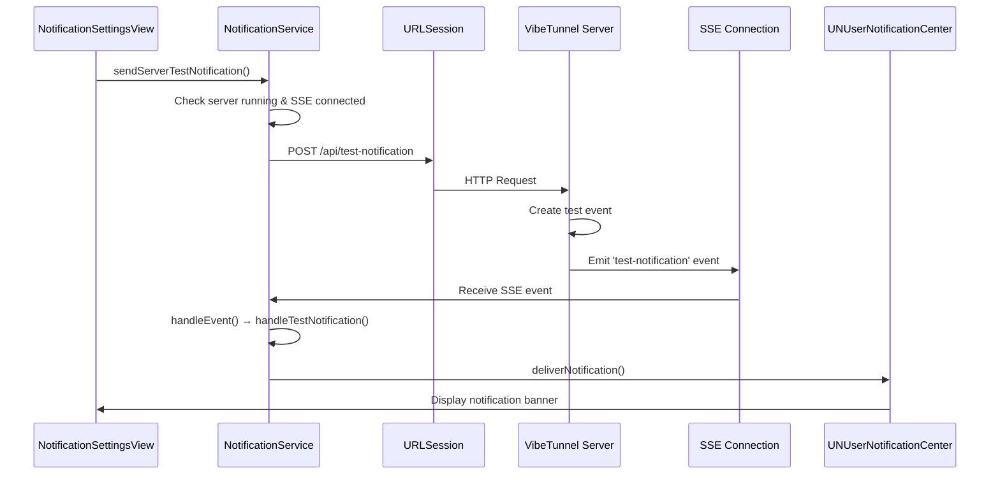

# VibeTunnel Test Notification Button - Working Implementation

## Overview

The test notification button in VibeTunnel is now fully functional! This document captures the working implementation details to ensure we don't lose this progress.

## Key Implementation Details

### 1. Server-Side Test Notification Endpoint

The test notification functionality works through a dedicated server endpoint that sends test notifications via Server-Sent Events (SSE):

**Endpoint**: `POST /api/test-notification`

```typescript
// web/src/server/routes/push.ts
router.post('/api/test-notification', async (req, res) => {
  // Sends a test-notification event via SSE
  const testEvent = {
    type: 'test-notification',
    title: 'VibeTunnel Test',
    body: 'Notifications are working correctly!',
    message: 'This is a test notification from VibeTunnel'
  };
  
  // Broadcast to all connected SSE clients
  eventEmitter.emit('test-notification', testEvent);
});
```

### 2. NotificationService SSE Handler

The Mac app's NotificationService listens for SSE events and handles test notifications:

```swift
// mac/VibeTunnel/Core/Services/NotificationService.swift
private func handleEvent(_ event: Event) {
    // ...
    case "test-notification":
        logger.info("🧪 Processing test-notification event")
        handleTestNotification(json)
    // ...
}

private func handleTestNotification(_ json: [String: Any]) {
    let title = json["title"] as? String ?? "VibeTunnel Test"
    let body = json["body"] as? String ?? "Server-side notifications are working correctly!"
    let message = json["message"] as? String
    
    let content = UNMutableNotificationContent()
    content.title = title
    content.body = body
    if let message = message {
        content.subtitle = message
    }
    content.sound = getNotificationSound()
    content.categoryIdentifier = "TEST"
    
    deliverNotification(content, identifier: "test-\(UUID().uuidString)")
}
```

### 3. UI Test Button Implementation

The test button in the NotificationSettingsView calls the server endpoint:

```swift
// mac/VibeTunnel/Presentation/Views/Settings/NotificationSettingsView.swift
Button("Test Notification") {
    Task {
        await notificationService.sendServerTestNotification()
    }
}

// mac/VibeTunnel/Core/Services/NotificationService.swift
@MainActor
func sendServerTestNotification() async {
    guard let url = serverProvider?.buildURL(endpoint: "/api/test-notification") else {
        logger.error("❌ Failed to build test notification URL")
        return
    }
    
    var request = URLRequest(url: url)
    request.httpMethod = "POST"
    request.setValue("application/json", forHTTPHeaderField: "Content-Type")
    
    // Add auth token if available
    if let authToken = serverProvider?.localAuthToken {
        request.setValue("Bearer \(authToken)", forHTTPHeaderField: "Authorization")
    }
    
    let (data, response) = try await URLSession.shared.data(for: request)
    // ... handle response
}
```

## Notification Flow Diagram



## Critical Success Factors

1. **SSE Connection Required**: The test notification requires an active SSE connection between NotificationService and the server
2. **Server Must Be Running**: The VibeTunnel server must be running for the endpoint to be available
3. **Notification Permissions**: User must have granted notification permissions to macOS
4. **UNUserNotificationCenter Delegate**: NotificationService must be set as the delegate to handle foreground notifications

## Debugging Tips

### Check SSE Connection Status
```swift
// NotificationService exposes connection status
var isSSEConnected: Bool { isConnected }
```

### Enable Detailed Logging
```bash
# View notification-related logs
./scripts/vtlog.sh -c NotificationService -n 100

# Filter for test notifications specifically
./scripts/vtlog.sh -s "test-notification" -n 50
```

### Common Issues and Solutions

1. **"Not connected to SSE endpoint"**
   - NotificationService tries to connect automatically when server starts
   - Check if Unix socket is ready before SSE connection

2. **401 Unauthorized**
   - Ensure auth token is properly passed in the request
   - Check if server auth mode matches client expectations

3. **No notification appears**
   - Check macOS notification permissions
   - Verify NotificationService is set as UNUserNotificationCenter delegate
   - Check if notifications are enabled in VibeTunnel settings

## Testing Checklist

- [ ] Server is running
- [ ] SSE connection established (check logs for "✅ Connected to notification event stream")
- [ ] Notification permissions granted in macOS
- [ ] Notifications enabled in VibeTunnel settings
- [ ] Click "Test Notification" button
- [ ] Notification appears with title "VibeTunnel Test"

## Implementation History

- Initial implementation struggled with SSE connection timing
- Fixed by ensuring Unix socket is ready before SSE connection
- Added proper auth token handling for secured servers
- Implemented dedicated test-notification event type
- Added comprehensive logging for debugging