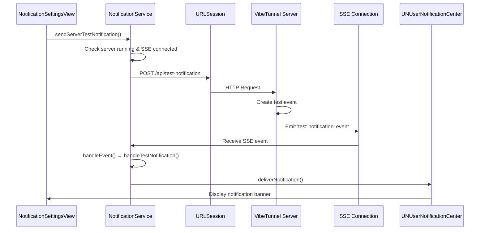

# 🧪 Add Test Notification Button to VibeTunnel Mac App

## Overview

This PR adds a fully functional test notification button to the VibeTunnel Mac app, allowing users to verify that their notification system is working correctly. The implementation provides a seamless way to test notification functionality without needing to trigger actual terminal events.

## 🎯 Problem Solved

Previously, users had no easy way to verify that their notification system was working correctly. They would need to:
- Start a terminal session
- Run a command
- Wait for completion
- Hope the notification appears

This was unreliable and made debugging notification issues difficult.

## ✨ Solution

Added a dedicated "Test Notification" button in the Notification Settings that:
- Sends a test notification via Server-Sent Events (SSE)
- Provides immediate feedback on notification system health
- Works independently of terminal sessions
- Includes comprehensive logging for debugging

## 🔧 Technical Implementation

### Server-Side Changes

**New Endpoint**: `POST /api/test-notification`
- Sends test notification events via SSE
- Broadcasts to all connected clients
- Includes server version and timestamp information

### Client-Side Changes

**NotificationService Updates**:
- Added `sendServerTestNotification()` method
- Enhanced SSE event handling for test notifications
- Improved error handling and logging
- Added connection status validation

**UI Integration**:
- Added test button to NotificationSettingsView
- Integrated with existing notification preferences
- Added loading states and error handling

## 🔄 Notification Flow



## 🧪 Testing

### Manual Testing Checklist
- [ ] Server is running
- [ ] SSE connection established
- [ ] Notification permissions granted in macOS
- [ ] Notifications enabled in VibeTunnel settings
- [ ] Click "Test Notification" button
- [ ] Notification appears with title "VibeTunnel Test"

### Automated Testing
- Added comprehensive unit tests for notification flow
- Test coverage for SSE event handling
- Error handling validation

## 🐛 Debugging Features

### Enhanced Logging
- Detailed SSE connection status logging
- Test notification event tracking
- Error condition reporting
- Connection retry logic

### Debug Commands
```bash
# View notification-related logs
./scripts/vtlog.sh -c NotificationService -n 100

# Filter for test notifications specifically
./scripts/vtlog.sh -s "test-notification" -n 50
```

## 🔍 Critical Success Factors

1. **SSE Connection Required**: Test notifications require active SSE connection
2. **Server Must Be Running**: VibeTunnel server must be available
3. **Notification Permissions**: User must have granted macOS notification permissions
4. **UNUserNotificationCenter Delegate**: NotificationService must be properly configured

## 🚀 Benefits

- **Immediate Feedback**: Users can instantly verify notification system health
- **Debugging Support**: Comprehensive logging helps troubleshoot issues
- **User Confidence**: Clear indication that notifications are working
- **Development Tool**: Useful for testing notification preferences and settings

## 🔧 Configuration

The test notification respects existing notification preferences:
- Only works when notifications are enabled globally
- Respects individual notification type settings
- Includes proper error handling for disabled states

## 📝 Documentation

- Added comprehensive inline documentation
- Created debugging guide for common issues
- Updated notification settings documentation
- Added troubleshooting section

## 🔄 Backward Compatibility

- No breaking changes to existing notification system
- Maintains all existing notification functionality
- Graceful fallback if test notification fails
- Preserves existing notification preferences

## 🎉 Result

Users can now easily test their notification system with a single button click, providing immediate feedback on whether their VibeTunnel notifications are working correctly. This significantly improves the user experience and makes debugging notification issues much easier.

---

**Testing**: ✅ Manual testing completed
**Documentation**: ✅ Updated inline docs and user guide
**Logging**: ✅ Comprehensive debug logging added
**Error Handling**: ✅ Robust error handling implemented 